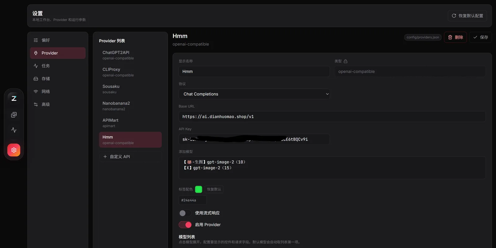

# ProxyCanvas

ProxyCanvas 是一个本地优先的 AI 图片生成工作台。它把 APIMart、ChatGPT2API、CLIProxyAPI、Nanobanana2、Sousaku、LumaLabs 以及 OpenAI-compatible 自定义 API 接入同一个 Web 界面，用于提交生成任务、管理参考图、保存结果、整理本地图廊和查看账号/任务状态。

项目由 Python Flask 后端和 Vite + React 前端组成。任务记录、图廊元数据、缩略图缓存和生成图片默认保存在本机，适合长期维护个人图片生成工作流。

## 界面预览

| 图廊工作台 | 图片详情 |
| --- | --- |
|  |  |

| 任务中心 | 账号池 |
| --- | --- |
|  |  |

| 自定义 API 接入 |
| --- |
|  |

## 核心能力

- **统一生成入口**：在同一界面切换 provider、模型、比例、分辨率、质量、数量和参考图，支持 OpenAI-compatible 自定义 API。
- **本地图廊管理**：保存图片、Prompt、生成参数、原始 URL、本地路径、标签和收藏状态，支持瀑布流/分页浏览、搜索筛选和缩略图缓存。
- **批量整理**：支持多选勾选、框选、批量删除、批量打标签、批量收藏和批量导出。
- **连续编辑**：支持参考图生成、结果复用、蒙版/选区编辑和局部重绘。
- **任务中心**：记录后台任务、任务日志、执行状态、失败原因、结果预览和保存路径。
- **账号与配置管理**：支持 Sousaku token 导入、账号刷新、启用/禁用、删除、余额/额度展示，以及 provider、代理、保存目录、缩略图和并发参数配置。

## 快速开始

环境要求：

- Python 3.10+
- Node.js 20+
- npm 10+

获取项目：

```powershell
git clone https://github.com/SeralMoni/ProxyCanvas.git
cd ProxyCanvas
```

安装依赖：

```powershell
cd backend_v2
pip install -r requirements.txt

cd ..\frontend_v2
npm install
```

启动后端：

```powershell
cd backend_v2
python -u app.py
```

启动前端：

```powershell
cd frontend_v2
npm run dev
```

默认地址：

```text
前端: http://localhost:5380
后端: http://localhost:5700
```

Windows 用户也可以在安装依赖后运行 `start.bat`。脚本会启动 ProxyCanvas 后端和前端；如果配置了 CLIProxyAPI 或 ChatGPT2API 路径，也会一并启动对应服务。

## 配置

常用设置可以直接在前端设置页修改，包括 provider、Base URL、API Key、模型列表、代理、保存目录、缩略图和任务并发等参数。设置会写入本地配置文件。

主要配置文件位于 `config/`，也可以手动编辑：

- `config/app_settings.json`：端口、保存目录、代理、缩略图、图廊偏好、任务并发等运行设置。
- `config/providers.json`：provider 列表、Base URL、API Key、模型列表、前端参数控件和能力描述。
- `config/sousaku_config.json`：Sousaku token、账号轮换和 credit 估算配置。
- `config/lumalabs_config.json`：LumaLabs 会话配置，可从 `config/lumalabs_config.example.json` 复制后填写。

常用 provider 配置示例：

```json
{
  "providers": {
    "apimart": {
      "baseUrl": "https://api.apimart.ai",
      "apiKey": "sk-your-token"
    },
    "openai": {
      "baseUrl": "http://127.0.0.1:8010/v1",
      "apiKey": "chatgpt2api",
      "defaultModel": "gpt-image-2"
    }
  }
}
```

图片保存路径默认是项目根目录下的 `gallery/`。图廊数据库和任务数据库默认保存在 `data/`。

## 本地数据

ProxyCanvas 默认把运行数据保存在本机，包括：

- 任务数据库：`data/jobs.sqlite`
- 图廊数据库：`data/gallery.sqlite`
- 生成图片：`gallery/`
- 导入图片：`gallery/imports/`
- 缩略图缓存：`gallery/thumbnails/`
- 账号缓存：`config/sousaku_accounts.json`

真实配置、SQLite 数据库、生成图片、缩略图缓存、日志和构建产物不应提交到 Git。仓库中的 `.gitignore` 已覆盖常见运行数据；如果新增本地配置或缓存目录，请同步确认忽略规则。

## 上游服务

ProxyCanvas 适配多个外部项目或服务，包括但不限于：

- [ChatGPT2API](https://github.com/basketikun/chatgpt2api)
- [CLIProxyAPI](https://github.com/router-for-me/CLIProxyAPI)
- [Antigravity-Manager](https://github.com/lbjlaq/Antigravity-Manager)

外部服务的接口、模型能力和可用性可能变化；如果上游行为调整，ProxyCanvas 的适配层也可能需要同步更新。

## 免责声明

本项目仅供个人学习、技术研究与非商业性技术交流使用。

请遵守相关平台服务条款和当地法律法规。使用者应自行承担账号限制、额度损失、数据丢失以及违规使用导致的风险。

## License

MIT License
